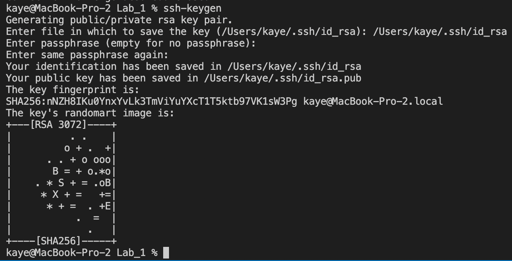

# ***How to log into a course-specific account on ieng6!***

1. Use the account lookup tool to find your course account username under “Additional Accounts” - it should start with letters corresponding to your course and the quarter you are enrolled in for that course. For example, if you’re enrolled in CSE 15L in fall quarter 2022, your account will start with “cs15lfa22” and end in two random letters.
2. When clicking on that account name, there will be a blue hyperlink that you can click to change your password. You will be redirected to the global password reset tool, where you will input your course account username (e.g. cs15lfa22) and PID. This should send you to a page called “Global Password Change Request.”
3. Follow the instructions to change your password, but do not click submit. Instead, in the last input box, click enter. You will either be told that the password doesn’t fit the proper requirements, or that your password change was a success. It should take up to 15 minutes for your password to take effect.
4. You can check to see if your password change has taken effect when logging into the Account Lookup tool again. It will tell you when your password was last changed. Once you see that it has been updated (make sure to refresh the page once in a while!), open a new terminal in Visual Studio Code.
5. In the terminal, type ssh, your course username, and add @ieng6.ucsd.edu immediately after your username. Press enter, and if you are connecting to the ieng6 server for the first time, you will be asked if you want to continue connecting. Make sure to type in ‘yes.’
6. You will be prompted to enter in your password. Nothing will actually show up in the terminal when you type in your password, but after typing in your password successfully, you will receive a message that you are logged into the ieng6 server and given a list of the ieng6 computers that you connected to.

We can do a lot of things when we ssh into a server! Below are a few examples of things I did to experiment with ssh and other commands.

## ***Installing Visual Studio Code***
1. Go to code.visualstudio.com.
2. Click the Download button and unzip the file that gets downloaded.
3. Install VS Code, and since I'm on a Mac, I dragged it to my Applications folder.
4. Afterwards, I was able to use the application.
These steps aren't that hyperspecific since I already had VS Code installed before this class.

## ***Remotely Connecting (a simplified version of the first steps above)***
1. I opened up a new terminal in VS Code.
2. I ssh to the ieng6 server using my ieng6 email and password.
3. Then I was remotely connected!

## ***Trying some commands***
1. I tried some commands while logged into the ieng6 computer, though some commands, like cd and cd ~ didn’t work (they didn’t work on my computer either).
2. Other commands like ls -lat, ls -a, and ls <directory> returned different things for my computer and for the ieng6 computer.
3. The cp and cat commands didn’t work on my computer, probably since I wasn’t connected to the ieng6 computer.

## ***Moving files with scp***
1. I created a new folder for Lab 1 and then created a new file in the folder called WhereAmI.java to include the code listed in the lab instructions.
2. Afterwards, I compiled and ran the code on my own computer and it returned my user name, the user home, and user directory. I used scp to copy WhereAmI.java into my account on the ieng6 server.
3. Then, I logged into the ieng6 server and compiled and ran WhereAmI.java there, and it gave the user name, user home, and user directory of the ieng6 computer I was logged into.

## ***Setting an SSH key***

1. I used ssh-keygen and saved it to the appropriate file. I set a very simple passcode.
2. I copied the public key to the directory of my user account on the server.
3. I tried to ssh to the server again, and this time I was prompted to use my passcode instead of my password!

## ***Optimizing remote running***
1. I actually used the up key a lot throughout this exercise when I would mess up commands and I use it a lot whenever I run commands in the terminal in general because it just feels like it saves so much time, especially since commands have be spelled exactly the same
2. I actually couldn’t really get all the commands to work, which is a bit disappointing since I wanted to see how useful they were.
  

