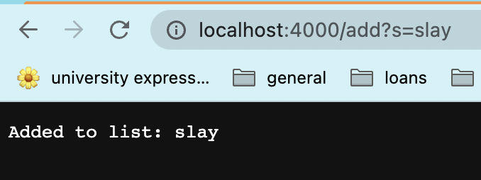

# **Part 1: Simplest Search Engine**

### The code for my search engine:
 

~~~
import java.io.IOException;
import java.util.*;
import java.net.URI;

class Handler implements URLHandler {
    // The one bit of state on the server: a number that will be manipulated by
    // various requests.
    int num = 0;
    ArrayList<String> added = new ArrayList<>();

    public String handleRequest(URI url) {
        if (url.getPath().equals("/")) {
            return String.format("Give me a string!");
        } else if (url.getPath().equals("/school")) {
            num += 1;
            return String.format("University of California, San Diego");
        } else {
            System.out.println("Path: " + url.getPath());
            if (url.getPath().contains("/add")) {
                String[] parameters = url.getQuery().split("=");
                if (parameters[0].equals("s")) {
                    added.add(parameters[1]);
                    return String.format("Added to list: %s", parameters[1]);
                }
            }
            else if (url.getPath().contains("/search")) {
                ArrayList<String> contained = new ArrayList<>();
                String[] parameters = url.getQuery().split("=");
                for(String search: added) {
                    if(search.contains(parameters[1])) {
                        contained.add(search);
                    }
                }
                return String.format("words containing %s: %s", parameters[1], contained.toString()); //to String prints out data structures
    
            }
            return "404 Not Found!";
        }
    }
}

class SearchEngine {
    public static void main(String[] args) throws IOException {
        if(args.length == 0){
            System.out.println("Missing port number! Try any number between 1024 to 49151");
            return;
        }

        int port = Integer.parseInt(args[0]);

        Server.start(port, new Handler());
    }
}
~~~
   
---
# Using my search engine!

   

*Using the add query to add a word to the list.*
  
>The add? query calls on the handleRequest method. This method takes in a URL as a parameter, and looks at certain parts of the URL to determine what to do. In this case, the method looks for what comes after the first forward slash in the URL. It recognizes the String that comes after the first forward slash and before the equals sign as a query signifying what action the method should take. When the recognized query is 'add,' the String following the equals sign is added to the ArrayList initialized at the beginning of the class, and the user is given feedback through the phrase "Added to list" before their added String.

   

*Adding another word to the list.*
   
>Here, I am using the same add query, except this time, the word after the equals sign and therefore the word that I am adding is "pineapple." Thus, the server tells me that I have added pineapple to my list.

 

*Searching for all words added to the list containing 'slay'.*
   

>I added several more Strings to my list that are not pictured here. This time, the image shows a different query, 'search,' that essentially looks through the list and returns all Strings that contain the phrase written after 'search?s='. 

   

***Overall***, the only fields defined in this method are the integer num and the String ArrayList added. Num is not actually used in this method, it's just a field I carried over from the original NumberServer.java file, but the String ArrayList is a field I created to store the list of Strings added by the 'add' query.

   
   
   

# **Part 2: Symptoms and Failure-Inducing Outputs**
   

### **ArrayList Method: reverseInPlace**
