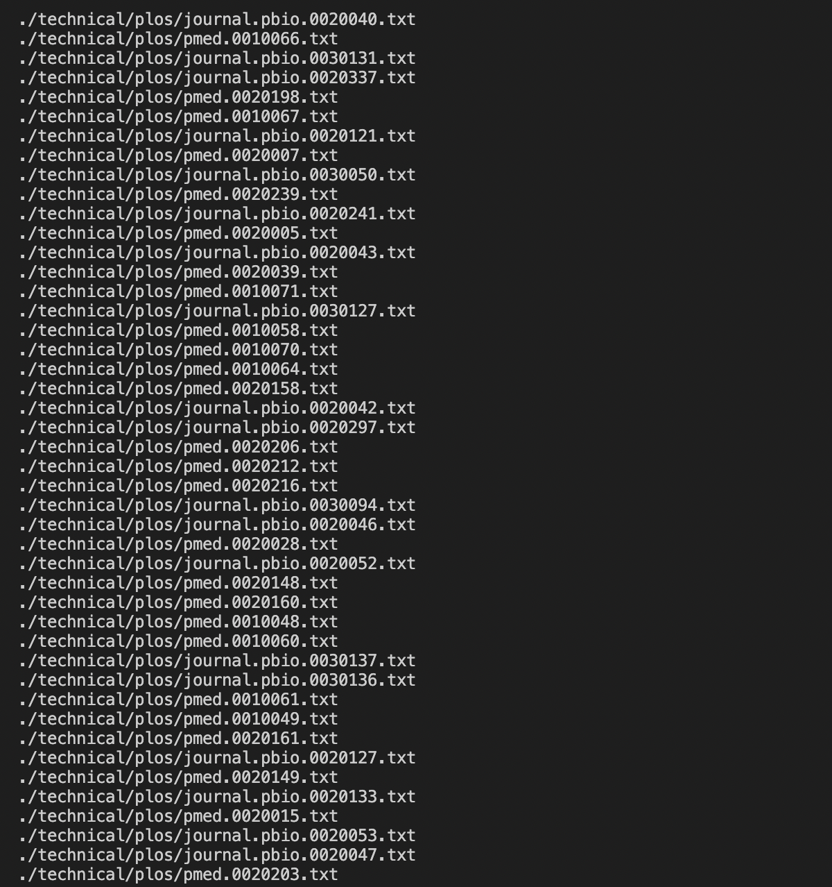

# Researching Commands

## ***The less command***
 

## Example 1: Basic Usage
 
In the command line, type:

~~~
less [OPTIONS] filename
~~~

  
Using the files provided from our lab in week 4 (docsearch), I used this command:

~~~
less technical/biomed/bcr458.txt
~~~

And received this output:
~~~
Introduction
Marin County, located north of San Francisco,
California, is distinguished among urban counties in the United States by its relatively small population (250,000 residents), by a median per-capita income of more than 200% that of the nation [ 1 ] , and by elevated rates of breast cancer that were first reported in the early 1990s [ 2 ] . The media has since pronounced Marin County 'the breast cancer capital of the world' [ 3 ] , and heightened community concern has inspired grassroots and scientific efforts to investigate reasons for the high incidence.
Initial studies have suggested that elevated rates in white women living in Marin County and the San Francisco Bay Area (SFBA) are generally explained by the higher prevalence of established breast cancer risk factors, including higher levels of education and income, later age at first birth, and nulliparity [ 4 5 ] . Our previous assessment of breast cancer incidence trends in Marin County isolated the rate elevation to women aged 45-64 years at diagnosis [ 6 ] . Community and scientific concern over increasing incidence rates has nevertheless remained high, so detailed surveillance o incidence and mortality rates has continued.
It has been estimated that only 45-55% of breast cancer cases in the United States are explained by established risk factors such as income, reproductive factors, and family history [ 7 ] . Distinctive breast cancer incidence and mortality patterns in well-defined populations may therefore inform etiologic understanding. For this reason, and as part of ongoing regional cancer surveillance efforts, we analyzed the most recent breast cancer incidence and mortality data available for Marin County and compared these rates and trends with those from other areas in California.
      
      
Materials and methods
        
Cancer incidence and mortality data 
We obtained cancer incidence and mortality data for Marin County and other California counties from the California Cancer Registry and the California Office of Vital Statistics, respectively. Analyses were based on new cases of invasive breast cancer ( International Classification of Diseases - Oncology , 2nd edition, site codes 50.0-50.9 excluding histology codes 9590-9989; invasive
:
~~~

>This is only a portion of the output. Essentially, when the less command is used like this, it prints out the contents of a file one page at a time. It is typically used for opening large files. In this case, the output was extremely long, and the ":" at the end signifies that the output goes on for longer to fit on one single page. You can continue to scroll down the page by using the scroll bar or down arrows, and go to the next page using the f key or space bar.

  
  

---
## Example 2: Line Count
 
In the command line, type:
~~~
less -N filename
~~~

  
Using the files provided from our lab in week 4 (docsearch), I used this command:

~~~
less -N technical/biomed/bcr458.txt
~~~

And received this output:

*I put it in as an image instead of a code block since copy-pasting the output directly messed up the formatting.*

>Using -N with the 'less' command prints out a very similar output as just using 'less' by itself, except this time it includes the number of each line in the file.

  
  

---
## Example 3: Multiple Files
 
In the command line, type:
~~~
less filename1 filename2 filename3
~~~
Essentially, you can look through the contents of multiple files by passing them in as multiple command line arguments.

  
Using the files provided from our lab in week 4 (docsearch), I used this command:

~~~
less technical/biomed/bcr458.txt technical/biomed/bcr607.txt
~~~

And received this output:

> This image only displays the last page of the first file passed into the less command, just to show that the last line doesn't just say (END). Instead, it shows that we can look at the next file passed into the command line, and we can access this file by pressing "n".

  
  

## ***The find command***
 

## Example 1: Finding Every File in the Current Directory

  
Using the files provided from our lab in week 4 (docsearch), I used this command:

~~~
find .
~~~

And received this output:

*This is a screenshot of only a portion of the output, since there are so many ./technical files within Docsearch.*
> This command 

