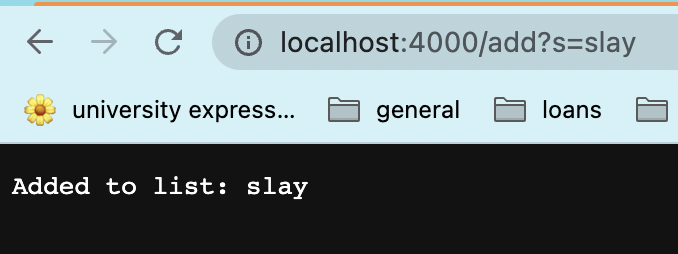
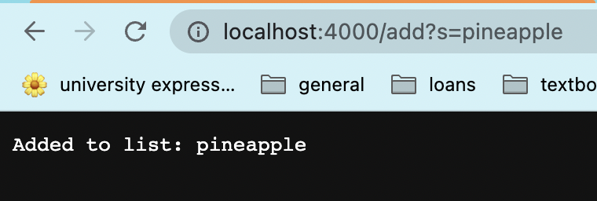
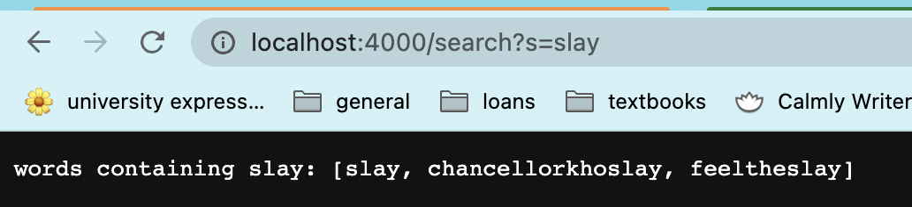
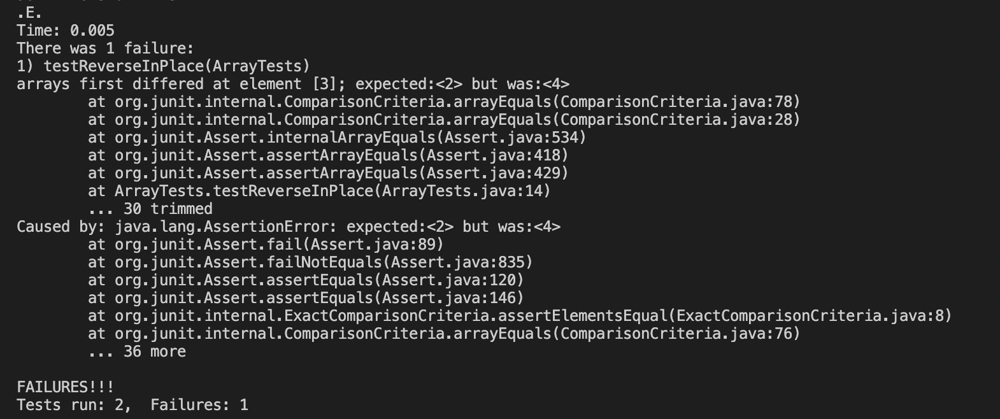
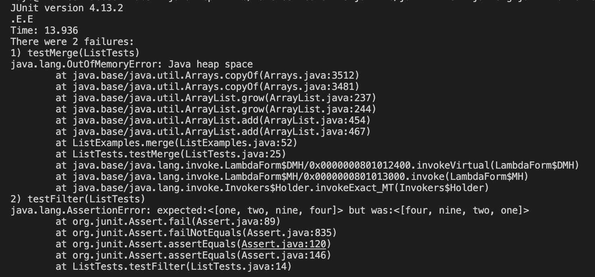

# **Part 1: Simplest Search Engine**

### The code for my search engine:
 

~~~
import java.io.IOException;
import java.util.*;
import java.net.URI;

class Handler implements URLHandler {
    // The one bit of state on the server: a number that will be manipulated by
    // various requests.
    int num = 0;
    ArrayList<String> added = new ArrayList<>();

    public String handleRequest(URI url) {
        if (url.getPath().equals("/")) {
            return String.format("Give me a string!");
        } else if (url.getPath().equals("/school")) {
            num += 1;
            return String.format("University of California, San Diego");
        } else {
            System.out.println("Path: " + url.getPath());
            if (url.getPath().contains("/add")) {
                String[] parameters = url.getQuery().split("=");
                if (parameters[0].equals("s")) {
                    added.add(parameters[1]);
                    return String.format("Added to list: %s", parameters[1]);
                }
            }
            else if (url.getPath().contains("/search")) {
                ArrayList<String> contained = new ArrayList<>();
                String[] parameters = url.getQuery().split("=");
                for(String search: added) {
                    if(search.contains(parameters[1])) {
                        contained.add(search);
                    }
                }
                return String.format("words containing %s: %s", parameters[1], contained.toString()); //to String prints out data structures
    
            }
            return "404 Not Found!";
        }
    }
}

class SearchEngine {
    public static void main(String[] args) throws IOException {
        if(args.length == 0){
            System.out.println("Missing port number! Try any number between 1024 to 49151");
            return;
        }

        int port = Integer.parseInt(args[0]);

        Server.start(port, new Handler());
    }
}
~~~
   
---
# Using my search engine!

   

*Using the add query to add a word to the list.*
  
>The add? query calls on the handleRequest method. This method takes in a URL as a parameter, and looks at certain parts of the URL to determine what to do. In this case, the method looks for what comes after the first forward slash in the URL. It recognizes the String that comes after the first forward slash and before the equals sign as a path, and the part that comes after the ? is the query signifying what action the method should take. When the recognized query is 'add,' the String following the equals sign is added to the ArrayList initialized at the beginning of the class, and the user is given feedback through the phrase "Added to list" before their added String.

   

*Adding another word to the list.*
   
>Here, I am using the same add query, except this time, the word after the equals sign and therefore the word that I am adding is "pineapple." Thus, the server tells me that I have added pineapple to my list.

 

*Searching for all words added to the list containing 'slay'.*
   

>Similar to the add query, the search? query calls on the handleRequest method. This method takes in a URL as a parameter, and looks at certain parts of the URL to determine what to do by looking at what comes after the first forward slash in the URL. It recognizes the String that comes after the first forward slash and before the equals sign as a path, and the part that comes after the ? is the query signifying what action the method should take. When the recognized query is 'search,' the algorithm searches through the entire ArrayList for words containing the String following the equals sign. The user is given feedback through the phrase "words containing" the String they are searching for, and an array of all the words that were added using the "add" query containing the String to "search" for.  

   

***Overall***, the only fields defined in this method are the integer num and the String ArrayList added. Num is not actually relevant to this method, it's just a field I carried over from the original NumberServer.java file, but the String ArrayList is a field I created to store the list of Strings added by the 'add' query.

   

# **Part 2: Symptoms and Failure-Inducing Inputs**
   

## **ArrayList Method: reverseInPlace**

 

### Original code:
---

~~~
public class ArrayExamples {

  // Changes the input array to be in reversed order
  static void reverseInPlace(int[] arr) {
    for(int i = 0; i < arr.length; i += 1) {
      arr[i] = arr[arr.length - i - 1];
    }
  }
}
~~~

  

### Test: failure-inducing input and symptoms
---

~~~
import static org.junit.Assert.*;
import org.junit.*;

public class ArrayTests {
	@Test 
    int[] input2 = {1,2,3,4,5};
    ArrayExamples.reverseInPlace(input2);
    assertArrayEquals(new int[]{5,4,3,2,1},input2);
	}
~~~

>My failure-inducing input for reverseInPlace was an integer array of {1,2,3,4,5}. The symptom/output when the test failed was that the 3rd index of the reversed list was expected to be 2, but its actual value was 4.
 

 
*Screenshot of the symptoms of reverseInPlace*

  

### The bug and how to fix it
---

This happened because when reversing the function from the beginning, the first few indexes are replaced by their corresponding values at the end of the list. Because of this, once the loop starts iterating through an index greater than half the length of the list, the last values are changed to the corresponding values at the beginning of the list, but they have already been changed. As a result, my test returns {5,4,3,4,5}.

~~~
public class ArrayExamples {

  static void reverseInPlace(int[] arr) {
    for(int i = 0; i < arr.length/2; i += 1) {
      int temp = arr[i];
      arr[i] = arr[arr.length - i - 1];
      arr[arr.length - i - 1] = temp;
    }
  }
}
~~~

> To fix the bug, I set a temporary variable that kept the original value of the first indexes in the array, and made sure that the loop does not iterate past the half-way index of the array. That way, the indexes of the first half of the array are effectively swapped with the last indexes of the array.

  
  

## **List Method: filter**

 

### Original code:
---

~~~
import java.util.ArrayList;
import java.util.List;

interface StringChecker { boolean checkString(String s); }

class ListExamples implements StringChecker{

  ListExamples() {}

  public boolean checkString(String s) {
    if(s.length() < 5) {
      return true;
    }
    return false;
  }

  // Returns a new list that has all the elements of the input list for which
  // the StringChecker returns true, and not the elements that return false, in
  // the same order they appeared in the input list;

  static List<String> filter(List<String> list, StringChecker sc) {
    List<String> result = new ArrayList<>();
    for(String s: list) {
      if(sc.checkString(s)) {
        result.add(0, s);
      }
    }
    return result;
  }
~~~

  

### Test: failure-inducing output and symptoms
---

~~~
import java.util.ArrayList;
import java.util.Arrays;
import java.util.List;
import static org.junit.Assert.*;
import org.junit.*;

public class ListTests {
    @Test
    public void testFilter(){

        List<String> input = Arrays.asList("one","two","three","seven","nine","four");
        StringChecker checker = new ListExamples();
        List<String> output = Arrays.asList("one","two","nine","four");
        assertEquals(output, ListExamples.filter(input,checker));

    }
}
~~~

>My failure-inducing input for checkString was a String List {"one","two","three","seven","nine","four"}. I made a checkString method that is supposed to return Strings that are less than 5 characters long, so the expected output was {"one","two","nine","four"}. The symptom when the test failed was that it returned {“four”,”nine”,”two”,”one”}. 
 

 *Screenshot of the symptoms of filter and merge*

  

### The bug and how to fix it
---

The method kept the correct Strings but in reverse order. This is because the for loop uses an add method that always adds from the 0th index (add(0,s)) instead of the end of the list. 

~~~
import java.util.ArrayList;
import java.util.List;

interface StringChecker { boolean checkString(String s); }

class ListExamples implements StringChecker{

  ListExamples() {}

  public boolean checkString(String s) {
    if(s.length() < 5) {
      return true;
    }
    return false;
  }

  // Returns a new list that has all the elements of the input list for which
  // the StringChecker returns true, and not the elements that return false, in
  // the same order they appeared in the input list;
  static List<String> filter(List<String> list, StringChecker sc) {
    List<String> result = new ArrayList<>();
    for(String s: list) {
      if(sc.checkString(s)) {
        result.add(s);
      }
    }
    return result;
  }
~~~

>This bug was a simple fix. All I had to do was change 'result.add(0,s)' to 'result.add(s)'. This makes the method add the String to the end of the List and not at the 0th index.

