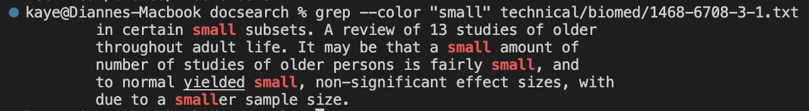
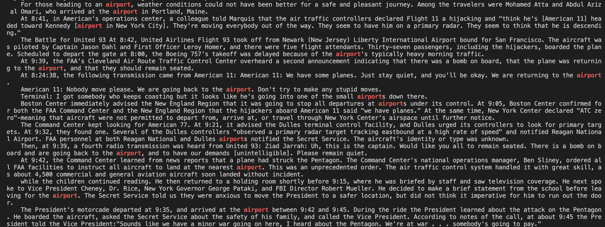
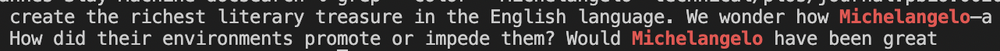
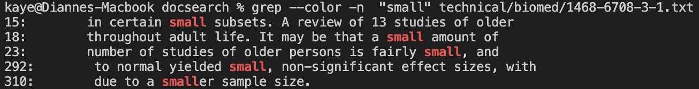
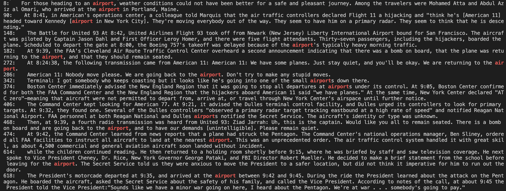

# Researching Commands

## ***The grep command***
 

## 1: Basic usage
 
In the command line, type:

~~~
grep [pattern] [filename]
~~~
grep looks for a pattern (e.g. a String expression) in the filename specified in the command line and prints out all the lines in that file that match that pattern.

 
This is useful when we want to find very specific information within lines, and so we can use the pattern as a keyword to instantly find the information we are looking for.

   

### ***Example 1***
Using the files provided from our lab in week 4 (docsearch), I used this command:

~~~
grep "small" technical/biomed/1468-6708-3-1.txt
~~~

And received this output:

~~~
in certain small subsets. A review of 13 studies of older throughout adult life. It may be that a small amount of number of studies of older persons is fairly small, and to normal yielded small, non-significant effect sizes, with due to a smaller sample size.
~~~
>The lines in this output don't really make sense when put together, but that's because these are all the lines that match the pattern I searched ("small").

  
  

### ***Example 2***
Using the files provided from our lab in week 4 (docsearch), I used this command:

~~~
grep "large" technical/911report/chapter-1.txt
~~~

And received this output:

~~~
They were planning to hijack these planes and turn them into large guided missiles, loaded with up to 11,400 gallons of jet fuel. By 8:00 A.M. on the morning of Tuesday, September 11,2001, they had defeated all the security layers that America's civil aviation security system then had in place to prevent a hijacking. The Hijacking of American 11 American Airlines Flight 11 provided nonstop service from Boston to Los Angeles. On September 11, Captain John Ogonowski and First Officer Thomas McGuinness piloted the Boeing 767. It carried its full capacity of nine flight attendants. Eighty-one passengers boarded the flight with them (including the five terrorists).22 The plane took off at 7:59. Just before 8:14, it had climbed to 26,000 feet, not quite its initial assigned cruising altitude of 29,000 feet. All communications and flight profile data were normal. About this time the "Fasten Seatbelt" sign would usually have been turned off and the flight attendants would have begun preparing for cabin service.
~~~
>The lines in this output don't really make sense when put together, but that's because these are all the lines that match the pattern I searched ("small").

  
  

### ***Example 3***
Using the files provided from our lab in week 4 (docsearch), I used this command:

~~~
grep "Michelangelo" technical/plos/journal.pbio.0020047.txt
~~~

And received this output:

~~~
create the richest literary treasure in the English language. We wonder how Michelangelo—a
How did their environments promote or impede them? Would Michelangelo have been great
~~~
>The lines in this output don't really make sense when put together, but that's because these are all the lines that match the pattern I searched ("small").

  
  

---
## 2: Color-coding the pattern we are looking for
 
In the command line, type:

~~~
grep --color [pattern] [filename]
~~~
This command works similarly to using grep normally, but this time we included the 'option' of color coding the pattern we are looking for using --color. This means that when our lines within the specified file include the pattern we're searching for, those lines are printed with the pattern we are looking for highlighted in the color red.

 
If we are using the pattern as a keyword within a file, it can be helpful to color-code that keyword when many lines match the pattern we are looking for to distinguish the exact information that we need.

  

### ***Example 1***
Using the files provided from our lab in week 4 (docsearch), I used this command:

~~~
grep --color "small" technical/biomed/1468-6708-3-1.txt
~~~

And received this output:

>The pattern I was searching for was "small", so this time all lines within the file 1468-6708-3-1.txt within the biomed directory in technical were printed with "small" being highlighted in red.

  
  

### ***Example 2***
Using the files provided from our lab in week 4 (docsearch), I used this command:

~~~
grep --color  "airport" technical/911report/chapter-1.txt
~~~

And received this output:

>The pattern I was searching for was "small", so this time all lines within the file 1468-6708-3-1.txt within the biomed directory in technical were printed with "small" being highlighted in red.

  
  

### ***Example 3***
Using the files provided from our lab in week 4 (docsearch), I used this command:

~~~
grep --color  "Michelangelo" technical/plos/journal.pbio.0020047.txt
~~~

And received this output:

>The pattern I was searching for was "small", so this time all lines within the file 1468-6708-3-1.txt within the biomed directory in technical were printed with "small" being highlighted in red.

  
  

---
## 3: Line numbers of successful matches
 
In the command line, type:

~~~
grep -n [pattern] [filename]
~~~
This command works similarly to using grep normally, but this time we included the 'option' of printing out the line numbers of each line we looked for. When our lines within the specified file include the pattern we are looking for, they printed along side the corresponding line numbers they have in their file.

 
If we are looking for information using patterns as a keyword within a file, knowing the line numbers of that information can be useful if we need additional context. If we are able to locate those lines within the file (using a command like [less -N [filename]] listed in a previous example), we may be able to get additional context by looking at the lines directly next to the ones we searched for.

   

### ***Example 1***
Using the files provided from our lab in week 4 (docsearch), I used this command:

~~~
grep --color -n  "small" technical/biomed/1468-6708-3-1.txt
~~~

And received this output:

>I actually combined two different 'options' here, --color and -n. In this picture, the line number of each matching line within their file is printed alongside those lines. Since I used --color as well, the pattern I searched for in these lines, "small", is highlighted in red as well.

  
  

### ***Example 2***
Using the files provided from our lab in week 4 (docsearch), I used this command:

~~~
grep --color -n  "airport" technical/911report/chapter-1.txt
~~~

And received this output:

>I actually combined two different 'options' here, --color and -n. In this picture, the line number of each matching line within their file is printed alongside those lines. Since I used --color as well, the pattern I searched for in these lines, "small", is highlighted in red as well.

  
  

### ***Example 3***
Using the files provided from our lab in week 4 (docsearch), I used this command:

~~~
grep --color -n  "Michelangelo" technical/plos/journal.pbio.0020047.txt
~~~

And received this output:

>I actually combined two different 'options' here, --color and -n. In this picture, the line number of each matching line within their file is printed alongside those lines. Since I used --color as well, the pattern I searched for in these lines, "small", is highlighted in red as well.

  
  
