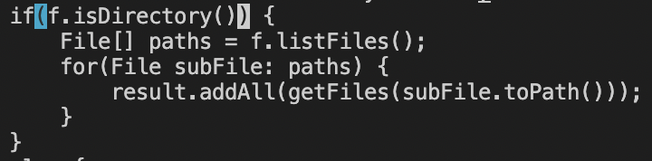
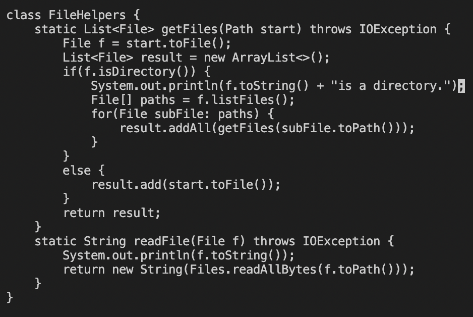

# Working with Vim

From our week 6 lab, my lab partner and I worked on this task:
>Adding a new line to print before File[] paths = f.listfiles()

 

### **This is the shortest sequence of vim commands that we came up with to accomplish this task:**

 

`
vim DocSearchServer.java <enter>
`
>
`
/File[] path <enter>
`

Using the search command in vim, I found the first and only occurence of "/File[] path" and the cursor starts on the capital F of "File" in the 7th line in the picture.

  

`
k
`

The k command moves the cursor directly up by one line. The cursor is now on the first "." of the 6th line in the picture.

  

`
e e e
`

>The first press of e.

>The second press of e.

>The third press of e.

Pressing e three times allowed me to get to the end of the line faster by moving the cursor to the end of a word.

  

`
a <enter>
`

After getting to the end of the line, this command puts me in INSERT mode (which is signified by "-- INSERT --" at the bottom). I press enter to get a new line.

  

`
System.out.println(f.toString() + “is a directory.”); <esc>
`

In insert mode, I am able to type normally to edit the file. Pressing escape exits INSERT mode. I can tell I'm not in INSERT mode anymore because "-- INSERT --" is not longer at the bottom.

  

`
:wq <enter>
`

Finally, I use the ":wq" command to save the file and quit vim mode. I can see that I have exited vim mode since I am back in the normal terminal.

  
  

# Managing Workflow

It took me about 1 minute and 30 seconds to make the edit in Visual Studio Code and scp the file locally. It took me a little less than a minute to make the edit while already logged in remotely.

 

**Which of these two styles would you prefer using if you had to work on a program that you were running remotely, and why?**
>I would prefer the second option, where I am already logged into an ssh session and make my edits to the file using vim. I felt that my workflow when doing this went much faster, just because vim has shortcuts that can make traversing to the end of lines much easier. It could also be annoying if I'm working remotely and I realize that I need to make a quick edit to my file; I wouldn't want to go back locally and scp the file again. It makes more sense to directly edit the file remotely using vim so I don't need to log in again.

 

**What about the project or task might factor into your decision one way or another?**
>If I had to make large edits, I would definitely use Visual Studio Code locally. I just find it much easier to move around large blocks of code normally rather than in vim. But if I were doing small edits, I wouldn't mind using vim remotely.