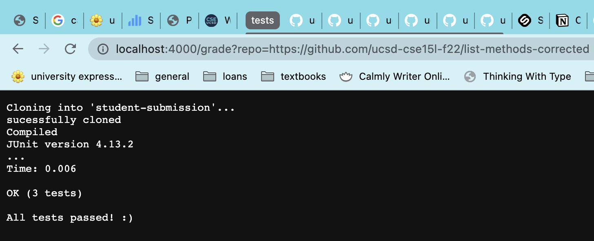
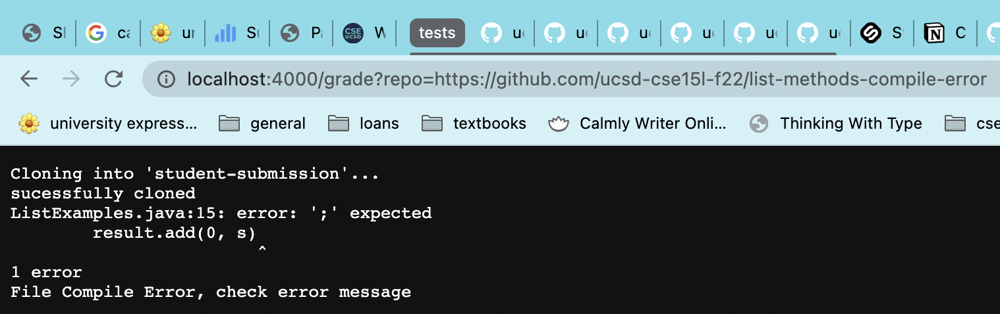
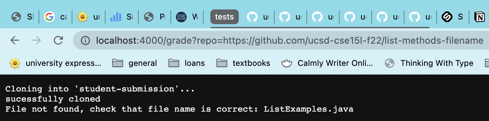

# Lab Report 5: Grading Scripts

## **My grading script:**

 

~~~
CP=".:../lib/hamcrest-core-1.3.jar:../lib/junit-4.13.2.jar"
let PASSED=0
let TOTAL=0

rm -rf student-submission/
git clone $1 student-submission/

echo "sucessfully cloned"

cp TestListExamples.java student-submission/
cd student-submission/

if [ ! -e ListExamples.java ]
then
    echo "File not found, check that file name is correct: ListExamples.java"
    exit 1
fi

javac -cp $CP *.java

if [ $? -gt 0 ]
    then
    echo "File Compile Error, check error message"
    exit 1 
fi

echo "Compiled"

java -cp $CP org.junit.runner.JUnitCore TestListExamples

if [ $? -eq 00 ]
then
    let PASSED++
    let TOTAL++
    echo "All tests passed! :)"
else
    let TOTAL++
    echo "Some tests failed. :("
fi
~~~
*There are two variables, "PASSED" and "TOTAL", that were meant to represent an overall score, but I was not able to figure out how to implement them properly into the messages echoed by my grading script.*

  

---

## **Three different student submissions:**

 

### *1: All tests passed (correct method implementation)*

 

### *2: Syntax error: missing semicolon*

 

### *3: Incorrect file name*

 

> rm -rf student-submission/
- "rm" - deletes files and directories
- "-rf" - deletes all files and directories 'forcefully'
    - "-r" - deletes a directory, its files and subfiles recursively
    - "-f" - forcefully deletes a file or directory (does not prompt a confirmation)
- so, this command deletes the directory "student-submission/" and all files within it so that whenever it runs a new student's submission, it does not also run the submission of a previous student
    - the results of this command will be sent to standard output, and returns an exit code of 0 since it ran successfully

 

> git clone $1 student-submission/
- clones the first argument passed to the bash script, which is the link to the student's repository in this case
    - results of the command are sent to standard output; should have a return code of 0 since the repository was successfully cloned

 

> echo "sucessfully cloned"
- displays the argument "succesfully cloned" as output to the user
    - "successfully cloned" is passed in as standard *input* into echo
    - the results of this command will be sent to standard output, and returns exit code 0 since it ran properly

 

> cp TestListExamples.java student-submission/
- copies the file "TestListExamples.java" into the student's submitted repository
    - returns exit code 0 since it ran properly

 

> cd student-submission/
- moves into the student submission directory
    - returns exit code 0 since it ran properly

 

~~~
if [ ! -e ListExamples.java ]
then
    echo "File not found, check that file name is correct: ListExamples.java"
    exit 1
fi
~~~
- "-e FILENAME" checks if the file exists, and "!" essentially acts as a "NOT" operator
    - together, this if statement is checking if the given filename *does not* exist in the repository; 'doesn't exist' equates to 'true'
- in this case, the file "ListExamples.java" was not in the student's submission, so the if statement evaluates to 'true' and the script displays the output "File not found, check that file name is correct: ListExamples.java" to the server
    - even though the grading script displays that this submission is invalid, the results of this command are still sent to standard output since no actual error message was thrown
    - the bash script exits with a return code of 1 to indicate the task's failure

 

Every line moving forward in this bash script does not run, since we exited the script early.

  

